# Databrewery Database Documentation

Complete database schema documentation with Entity-Relationship Diagrams for the Databrewery annotation platform.

## 📊 Database Overview

- **Total Tables:** 103
- **Database Type:** PostgreSQL
- **Architecture:** Multi-tenant SaaS platform
- **Modules:** 5 major functional modules

---

## 🗂️ Module Structure

### 1. User & Authentication (21 tables)
### 2. Projects & Tasks (21 tables)
### 3. ML Models & Data Management (21 tables)
### 4. Storage Systems (21 tables)
### 5. Organization & Workflows (19 tables)

---

## 📈 Entity-Relationship Diagrams

### 1️⃣ User & Authentication Module

**Tables:** `htx_user`, `users_userprofile`, `authtoken_token`, `auth_group`, `auth_permission`, `users_invitation`, `user_group`, and more.

**Key Features:**
- User authentication and authorization
- Profile management (standard & extended)
- Groups and permissions
- API token management
- Magic link passwordless login
- User bank details for payments
- Invitation system for onboarding

```mermaid
%%{init: {'theme':'base', 'themeVariables': { 'primaryColor':'#fff','primaryTextColor':'#000','primaryBorderColor':'#000','lineColor':'#000','secondaryColor':'#f4f4f4','tertiaryColor':'#fff','fontSize':'16px','fontFamily':'Arial'}}}%%
erDiagram
    %% User & Authentication Module ERD (21 tables)
    
    htx_user ||--o{ authtoken_token : "has"
    htx_user ||--o| users_userprofile : "has"
    htx_user ||--o| user_profile_newuserprofile : "has"
    htx_user ||--o| users_userbankdetails : "has"
    htx_user ||--o{ users_magiclink : "generates"
    htx_user ||--o{ htx_user_groups : "belongs to"
    htx_user ||--o{ htx_user_user_permissions : "has"
    htx_user ||--o{ users_invitation : "creates"
    htx_user ||--o{ user_group_membership : "member of"
    
    auth_group ||--o{ htx_user_groups : "contains"
    auth_group ||--o{ auth_group_permissions : "has"
    
    auth_permission ||--o{ auth_group_permissions : "assigned to"
    auth_permission ||--o{ htx_user_user_permissions : "assigned to"
    auth_permission }o--|| django_content_type : "for"
    
    organization ||--o{ users_invitation : "invites to"
    organization ||--o{ organizations_organizationmember : "has members"
    htx_user ||--o{ organizations_organizationmember : "member of"
    
    user_group ||--o{ user_group_membership : "has members"
    htx_user ||--o{ user_group : "creates"
    organization ||--o{ user_group : "owns"
    
    users_invitation ||--o{ users_invitationgroupmember : "for group"
    users_invitation ||--o{ users_invitationprojectmember : "for project"
    users_invitation ||--o{ users_invitationworkspacemember : "for workspace"
    
    user_group ||--o{ users_invitationgroupmember : "invited to"

    htx_user {
        serial id PK
        varchar username UK
        varchar email UK
        varchar password
        timestamptz last_login
        boolean is_superuser
        boolean is_staff
        boolean is_active
        timestamptz date_joined
        varchar avatar
        varchar phone
        boolean allow_newsletters
        integer active_organization_id FK
        timestamptz last_activity
        varchar email_user_type
        integer consecutive_login_days
        date consecutive_login_start
        jsonb data
        integer created_by_id FK
    }
    
    users_userprofile {
        serial id PK
        text bio
        varchar profile_image
        varchar gender
        varchar ethnicity
        varchar country_of_origin
        integer user_id FK "UK"
        varchar company_name
        varchar role
    }
    
    user_profile_newuserprofile {
        serial id PK
        jsonb data
        timestamptz created_at
        timestamptz updated_at
        integer user_id FK "UK"
        double_precision annotations_time_spent
        timestamptz last_sync_count
    }
    
    authtoken_token {
        varchar key PK
        timestamptz created
        integer user_id FK "UK"
    }
    
    users_userbankdetails {
        serial id PK
        varchar account_holder_name
        varchar bank_name
        varchar account_number
        varchar ifsc_code
        varchar branch_name
        varchar upi_id
        timestamptz created_at
        timestamptz updated_at
        integer user_id FK "UK"
        varchar pancard_number
        text address
    }
    
    users_magiclink {
        varchar token PK
        timestamptz created_at
        integer user_id FK
    }
    
    auth_group {
        serial id PK
        varchar name UK
    }
    
    auth_permission {
        serial id PK
        varchar name
        integer content_type_id FK
        varchar codename
    }
    
    django_content_type {
        serial id PK
        varchar app_label
        varchar model
    }
    
    htx_user_groups {
        serial id PK
        integer user_id FK
        integer group_id FK
    }
    
    htx_user_user_permissions {
        serial id PK
        integer user_id FK
        integer permission_id FK
    }
    
    auth_group_permissions {
        serial id PK
        integer group_id FK
        integer permission_id FK
    }
    
    organization {
        serial id PK
        timestamptz created_at
        timestamptz updated_at
        text title
        jsonb contact_info
        integer created_by_id FK
        varchar token UK
    }
    
    organizations_organizationmember {
        serial id PK
        timestamptz created_at
        timestamptz updated_at
        timestamptz deleted_at
        integer organization_id FK
        integer user_id FK
        varchar role
        varchar role_type
    }
    
    users_invitation {
        serial id PK
        varchar uuid UK
        boolean expired
        timestamptz created_at
        integer use_count
        jsonb defaults
        boolean can_manage_billing
        integer created_by_id FK
        integer organization_id FK
        varchar groups_to_join
        integer max_uses
    }
    
    user_group {
        serial id PK
        varchar title
        text description
        timestamptz created_at
        timestamptz updated_at
        integer created_by_id FK
        integer organization_id FK
    }
    
    user_group_membership {
        serial id PK
        timestamptz created_at
        timestamptz updated_at
        integer created_by_id FK
        integer group_id FK
        integer user_id FK
        varchar role
        varchar role_type
        varchar email_user_type
        varchar invitation_link
        timestamptz invited_at
    }
    
    users_invitationgroupmember {
        serial id PK
        integer group_id FK
        integer invitation_id FK
    }
    
    users_invitationprojectmember {
        serial id PK
        integer project_id FK
        integer invitation_id FK
        varchar role
    }
    
    users_invitationworkspacemember {
        serial id PK
        integer workspace_id FK
        integer invitation_id FK
        varchar role
    }
```



---

### 2️⃣ Projects & Tasks Module

**Tables:** `project`, `task`, `task_completion`, `tasks_annotationdraft`, `tasks_tasklock`, `tasks_notes`, `projects_projectmember`, and more.

**Key Features:**
- Project creation and management
- Task organization
- Annotation workflow
- Draft saving
- Task locking (prevent concurrent edits)
- Comments and collaboration
- Task flags and tags
- Project groups
- Import/export tracking

```mermaid
%%{init: {'theme':'base', 'themeVariables': { 'primaryColor':'#fff','primaryTextColor':'#000','primaryBorderColor':'#000','lineColor':'#000','secondaryColor':'#f4f4f4','tertiaryColor':'#fff','fontSize':'16px','fontFamily':'Arial'}}}%%
erDiagram
    %% Projects & Tasks Module ERD (21 tables)
    
    project ||--o{ task : "contains"
    project ||--o{ projects_projectmember : "has members"
    project ||--o{ projects_projectimport : "imports data"
    project ||--o{ projects_projectsummary : "has summary"
    project ||--o| projects_projectonboarding : "has onboarding"
    project ||--o| projects_projectclientapiconfiguration : "has API config"
    project ||--o{ projects_projectopsmanager : "managed by"
    project ||--o{ projects_labelstreamhistory : "has history"
    project ||--o{ projects_projectreimport : "reimports"
    project ||--o{ projects_projecttag : "tagged with"
    project }o--o{ projects_projectgroup : "belongs to"
    
    task ||--o{ task_completion : "has annotations"
    task ||--o{ tasks_annotationdraft : "has drafts"
    task ||--o| tasks_tasklock : "locked by"
    task ||--o{ tasks_notes : "has comments"
    task ||--o{ task_comment_authors : "commented by"
    task ||--o{ task_flags : "has flags"
    task ||--o{ prediction : "has predictions"
    
    htx_user ||--o{ projects_projectmember : "member of"
    htx_user ||--o{ task_completion : "creates"
    htx_user ||--o{ tasks_annotationdraft : "drafts"
    htx_user ||--o{ tasks_tasklock : "locks"
    htx_user ||--o{ tasks_notes : "writes"
    htx_user ||--o{ task_comment_authors : "authors"
    
    organization ||--o{ project : "owns"
    workspace ||--o{ project : "contains"
    
    projects_tag ||--o{ projects_projecttag : "applied to"
    tasks_flag ||--o{ task_flags : "applied to"
    
    projects_projectgroup ||--o{ projects_projectgroup_projects : "contains"
    project ||--o{ projects_projectgroup_projects : "in group"
    
    projects_projectonboarding }o--|| projects_projectonboardingsteps : "at step"
    
    data_import_fileupload ||--o{ task : "creates"

    project {
        serial id PK
        text title
        text description
        text label_config
        text expert_instruction
        boolean show_instruction
        boolean show_skip_button
        boolean enable_empty_annotation
        boolean show_annotation_history
        integer organization_id FK
        varchar color
        integer maximum_annotations
        boolean is_published
        text model_version
        boolean is_draft
        integer created_by_id FK
        timestamptz created_at
        integer min_annotations_to_start_training
        boolean show_collab_predictions
        integer num_tasks_with_annotations
        integer task_number
        integer useful_annotation_number
        integer ground_truth_number
        integer skipped_annotations_number
        integer total_annotations_number
        integer total_predictions_number
        varchar sampling
        boolean show_ground_truth_first
        boolean show_overlap_first
        integer overlap_cohort_percentage
        jsonb control_weights
        text parsed_label_config
        boolean evaluate_predictions_automatically
        boolean config_has_control_tags
        varchar skip_queue
        boolean reveal_preannotations_interactively
        jsonb data_types
        timestamptz pinned_at
        integer finished_task_number
        integer queue_total
        integer queue_done
        jsonb summary
        integer workspace_id FK
    }
    
    task {
        serial id PK
        jsonb data
        jsonb meta
        timestamptz created_at
        timestamptz updated_at
        boolean is_labeled
        integer overlap
        integer project_id FK
        integer file_upload_id FK
        integer comment_count
        integer unresolved_comment_count
        timestamptz last_comment_updated_at
        integer updated_by_id FK
        integer inner_id
        integer total_annotations
        integer cancelled_annotations
        integer total_predictions
        integer comment_authors
        text annotations_results
        text predictions_results
        double_precision predictions_score
        text predictions_model_versions
        real avg_lead_time
        boolean draft_exists
    }
    
    task_completion {
        serial id PK
        jsonb result
        timestamptz created_at
        timestamptz updated_at
        real lead_time
        integer completed_by_id FK
        integer task_id FK
        integer project_id FK
        integer parent_prediction_id FK
        integer parent_annotation_id FK
        boolean was_cancelled
        boolean ground_truth
        integer result_count
        varchar unique_id UK
        integer import_id
        varchar last_action
        integer draft_id FK
        boolean honeypot
        boolean reviewed
        integer reviewed_by_id FK
        boolean was_submitted
        varchar review_flow_type
        integer fixed_annotation_history_id FK
    }
    
    tasks_annotationdraft {
        serial id PK
        jsonb result
        real lead_time
        timestamptz created_at
        timestamptz updated_at
        integer annotation_id FK "UK"
        integer task_id FK
        integer user_id FK
        varchar created_username
        varchar created_ago
    }
    
    tasks_tasklock {
        serial id PK
        timestamptz expire_at
        integer task_id FK "UK"
        integer user_id FK
        timestamptz created_at
    }
    
    tasks_notes {
        serial id PK
        text text
        timestamptz created_at
        timestamptz updated_at
        boolean is_resolved
        integer project_id FK
        integer task_id FK
        integer user_id FK
    }
    
    task_comment_authors {
        serial id PK
        integer task_id FK
        integer user_id FK
    }
    
    task_flags {
        serial id PK
        integer task_id FK
        integer flag_id FK
    }
    
    tasks_flag {
        serial id PK
        varchar title
        text description
        varchar color
        timestamptz created_at
    }
    
    projects_projectmember {
        serial id PK
        timestamptz created_at
        timestamptz updated_at
        boolean enabled
        integer user_id FK
        integer project_id FK
        varchar role
        varchar user_role
    }
    
    projects_projectimport {
        serial id PK
        text preannotated_from_fields
        boolean commit_to_project
        boolean return_task_ids
        varchar status
        varchar url
        text traceback
        timestamptz created_at
        timestamptz updated_at
        integer task_count
        integer annotation_count
        integer prediction_count
        integer duration
        integer file_upload_ids
        boolean could_be_tasks_list
        jsonb found_formats
        jsonb data_columns
        integer project_id FK
        boolean serialize_json_as_string
    }
    
    projects_projectsummary {
        serial id PK
        timestamptz created_at
        timestamptz updated_at
        jsonb all_data_columns
        jsonb common_data_columns
        integer project_id FK "UK"
        jsonb created_labels
        integer created_annotations
    }
    
    projects_projectonboarding {
        serial id PK
        timestamptz created_at
        timestamptz updated_at
        boolean finished
        integer project_id FK "UK"
        integer step_id FK
    }
    
    projects_projectonboardingsteps {
        serial id PK
        text title
        text description
        varchar link
        varchar video
        integer order UK
        boolean enabled
    }
    
    projects_projectclientapiconfiguration {
        serial id PK
        integer review_period
        timestamptz created_at
        timestamptz updated_at
        text public_data_link
        varchar status
        integer project_id FK "UK"
    }
    
    projects_projectopsmanager {
        serial id PK
        boolean is_processed
        timestamptz requested_at
        timestamptz processed_at
        varchar request_type
        integer project_id FK
    }
    
    projects_labelstreamhistory {
        serial id PK
        timestamptz created_at
        integer project_id FK
        integer user_id FK
    }
    
    projects_projectreimport {
        serial id PK
        varchar status
        text traceback
        timestamptz created_at
        timestamptz updated_at
        integer task_count
        integer annotation_count
        integer prediction_count
        integer duration
        text preannotated_from_fields
        integer project_id FK
        boolean commit_to_project
    }
    
    projects_projecttag {
        serial id PK
        integer project_id FK
        integer tag_id FK
    }
    
    projects_tag {
        serial id PK
        varchar title
        text description
        timestamptz created_at
    }
    
    projects_projectgroup {
        serial id PK
        varchar title
        text description
        timestamptz created_at
        timestamptz updated_at
        integer created_by_id FK
        integer organization_id FK
    }
    
    projects_projectgroup_projects {
        serial id PK
        integer projectgroup_id FK
        integer project_id FK
    }
```



---

### 3️⃣ ML Models & Data Management Module

**Tables:** `ml_mlbackend`, `ml_mlbackendpredictionjob`, `ml_models_modelinterface`, `prediction`, `data_manager_view`, `labels_manager_label`, and more.

**Key Features:**
- ML backend integration
- Model training and prediction jobs
- Third-party AI provider connections (OpenAI, etc.)
- Model versioning
- Predictions on tasks
- Data filtering and views
- Label management
- Import/export functionality

```mermaid
%%{init: {'theme':'base', 'themeVariables': { 'primaryColor':'#fff','primaryTextColor':'#000','primaryBorderColor':'#000','lineColor':'#000','secondaryColor':'#f4f4f4','tertiaryColor':'#fff','fontSize':'16px','fontFamily':'Arial'}}}%%
erDiagram
    %% ML Models & Data Management Module ERD (21 tables)
    
    project ||--o{ ml_mlbackend : "uses"
    ml_mlbackend ||--o{ ml_mlbackendpredictionjob : "runs"
    ml_mlbackend ||--o{ ml_mlbackendtrainjob : "trains"
    
    project ||--o| ml_model_providers_modelproviderconnection : "connects to"
    organization ||--o{ ml_model_providers_modelproviderconnection : "manages"
    
    ml_model_providers_modelproviderconnection ||--o{ ml_models_thirdpartymodelversion : "versions"
    organization ||--o{ ml_models_modelinterface : "owns"
    project ||--o{ ml_models_modelinterface : "uses"
    ml_models_modelinterface }o--o{ project : "associated with"
    
    ml_models_modelinterface ||--o{ ml_models_modelrun : "executes"
    task ||--o{ ml_models_modelrun : "processed by"
    task_completion ||--o{ ml_models_modelrun : "generates"
    
    task ||--o{ prediction : "predicted for"
    project ||--o{ prediction : "contains"
    ml_models_modelrun ||--o{ prediction : "creates"
    
    project ||--o{ data_manager_view : "has views"
    htx_user ||--o{ data_manager_view : "creates"
    data_manager_filtergroup ||--o{ data_manager_view : "filters"
    
    data_manager_filtergroup }o--o{ data_manager_filter : "contains"
    
    organization ||--o{ labels_manager_label : "defines"
    project ||--o{ labels_manager_label : "uses"
    htx_user ||--o{ labels_manager_label : "creates"
    labels_manager_label ||--o{ labels_manager_labellink : "applied to"
    task ||--o{ labels_manager_labellink : "labeled with"
    
    project ||--o{ data_import_fileupload : "uploads to"
    htx_user ||--o{ data_import_fileupload : "uploads"
    
    project ||--o{ data_export_export : "exports from"
    htx_user ||--o{ data_export_export : "requests"
    data_export_export ||--o{ data_export_convertedformat : "formats"

    ml_mlbackend {
        serial id PK
        varchar url
        varchar name
        text title
        text description
        text model_version
        boolean is_interactive
        timestamptz created_at
        timestamptz updated_at
        real timeout
        varchar state
        text error_message
        text traceback
        boolean auto_update
        integer project_id FK
        jsonb setup_args
        varchar auth_method
    }
    
    ml_mlbackendpredictionjob {
        serial id PK
        varchar job_id
        varchar model_version
        timestamptz created_at
        text error_message
        text traceback
        integer ml_backend_id FK
    }
    
    ml_mlbackendtrainjob {
        serial id PK
        varchar job_id
        timestamptz created_at
        text error_message
        text traceback
        integer ml_backend_id FK
    }
    
    ml_model_providers_modelproviderconnection {
        serial id PK
        varchar provider
        varchar api_key
        timestamptz created_at
        timestamptz updated_at
        integer organization_id FK
        integer project_id FK "UK"
        boolean is_active
    }
    
    ml_models_modelinterface {
        serial id PK
        timestamptz created_at
        timestamptz updated_at
        integer organization_id FK
        integer project_id FK
    }
    
    ml_models_modelinterface_associated_projects {
        serial id PK
        integer modelinterface_id FK
        integer project_id FK
    }
    
    ml_models_modelrun {
        serial id PK
        varchar model_version
        varchar status
        timestamptz created_at
        timestamptz updated_at
        text error_message
        text traceback
        integer model_interface_id FK
        integer project_id FK
        integer task_id FK
        integer task_completion_id FK
        real timeout
        boolean is_interactive
        integer retries
        jsonb data
    }
    
    ml_models_thirdpartymodelversion {
        serial id PK
        varchar provider
        varchar model_name
        varchar model_version
        boolean is_default
        timestamptz created_at
        timestamptz updated_at
        integer connection_id FK
        integer organization_id FK
        integer project_id FK
        jsonb model_metadata
    }
    
    prediction {
        serial id PK
        jsonb result
        double_precision score
        text model_version
        timestamptz created_at
        timestamptz updated_at
        integer task_id FK
        integer cluster
        jsonb neighbors
        real mislabeling
        integer project_id FK
        integer model_run_id FK
        integer import_id
    }
    
    data_manager_view {
        serial id PK
        jsonb data
        timestamptz created_at
        integer filter_group_id FK
        integer project_id FK
        integer user_id FK
        varchar view_type
    }
    
    data_manager_filter {
        serial id PK
        varchar column
        varchar operator
        varchar type
        jsonb value
        timestamptz created_at
    }
    
    data_manager_filtergroup {
        serial id PK
        varchar conjunction
    }
    
    data_manager_filtergroup_filters {
        serial id PK
        integer filtergroup_id FK
        integer filter_id FK
    }
    
    labels_manager_label {
        serial id PK
        varchar title
        text description
        varchar color
        timestamptz created_at
        integer organization_id FK
        integer project_id FK
        integer user_id FK
        timestamptz updated_at
        boolean is_active
        boolean is_system
    }
    
    labels_manager_labellink {
        serial id PK
        integer object_id
        timestamptz created_at
        integer label_id FK
        integer task_id FK
    }
    
    data_import_fileupload {
        serial id PK
        varchar file
        timestamptz created_at
        integer project_id FK
        integer user_id FK
        varchar format
        integer size
        varchar status
        text error_message
        text traceback
    }
    
    data_export_export {
        serial id PK
        timestamptz created_at
        timestamptz finished_at
        varchar status
        text md5
        integer counters
        integer created_by_id FK
        integer project_id FK
    }
    
    data_export_convertedformat {
        serial id PK
        varchar export_type
        varchar file
        text traceback
        timestamptz created_at
        integer export_id FK
        integer project_id FK
        integer created_by_id FK
        varchar status
        varchar md5
        timestamptz finished_at
        text status_message
    }
```



---

### 4️⃣ Storage Systems Module

**Tables:** S3, GCS, Azure Blob, Redis, and Local Files storage configurations (import/export).

**Key Features:**
- Multi-cloud storage support
- AWS S3 integration
- Google Cloud Storage integration
- Azure Blob Storage integration
- Redis caching/storage
- Local file system storage
- Storage links tracking
- Automatic sync capabilities
- Presigned URLs support

```mermaid
%%{init: {'theme':'base', 'themeVariables': { 'primaryColor':'#fff','primaryTextColor':'#000','primaryBorderColor':'#000','lineColor':'#000','secondaryColor':'#f4f4f4','tertiaryColor':'#fff','fontSize':'16px','fontFamily':'Arial'}}}%%
erDiagram
    %% Storage Systems Module ERD (21 tables)
    
    project ||--o| io_storages_s3importstorage : "imports from"
    project ||--o| io_storages_s3exportstorage : "exports to"
    project ||--o| io_storages_gcsimportstorage : "imports from"
    project ||--o| io_storages_gcsexportstorage : "exports to"
    project ||--o| io_storages_azureblobimportstorage : "imports from"
    project ||--o| io_storages_azureblobexportstorage : "exports to"
    project ||--o| io_storages_redisimportstorage : "imports from"
    project ||--o| io_storages_redisexportstorage : "exports to"
    project ||--o| io_storages_localfilesimportstorage : "imports from"
    project ||--o| io_storages_localfilesexportstorage : "exports to"
    
    io_storages_s3importstorage ||--o{ io_storages_s3importstoragelink : "links"
    io_storages_gcsimportstorage ||--o{ io_storages_gcsimportstoragelink : "links"
    io_storages_azureblobimportstorage ||--o{ io_storages_azureblobimportstoragelink : "links"
    io_storages_redisimportstorage ||--o{ io_storages_redisimportstoragelink : "links"
    io_storages_localfilesimportstorage ||--o{ io_storages_localfilesimportstoragelink : "links"
    
    task ||--o{ io_storages_s3importstoragelink : "from"
    task ||--o{ io_storages_gcsimportstoragelink : "from"
    task ||--o{ io_storages_azureblobimportstoragelink : "from"
    task ||--o{ io_storages_redisimportstoragelink : "from"
    task ||--o{ io_storages_localfilesimportstoragelink : "from"

    io_storages_s3importstorage {
        serial id PK
        varchar bucket
        varchar prefix
        varchar regex_filter
        boolean use_blob_urls
        varchar aws_access_key_id
        varchar aws_secret_access_key
        varchar aws_session_token
        varchar region_name
        varchar s3_endpoint
        boolean presign
        timestamptz presign_ttl
        timestamptz last_sync
        integer last_sync_count
        jsonb last_sync_errors
        varchar status
        text traceback
        text description
        timestamptz created_at
        timestamptz updated_at
        integer project_id FK "UK"
        varchar title
        boolean recursive_scan
        varchar glob_pattern
        boolean presign_urls
    }
    
    io_storages_s3exportstorage {
        serial id PK
        varchar bucket
        varchar prefix
        varchar aws_access_key_id
        varchar aws_secret_access_key
        varchar aws_session_token
        varchar region_name
        varchar s3_endpoint
        timestamptz created_at
        timestamptz updated_at
        integer project_id FK "UK"
        varchar title
        text description
        boolean can_delete_objects
        timestamptz last_sync
        integer last_sync_count
        jsonb last_sync_errors
        varchar status
        text traceback
        jsonb serialization_options
        boolean is_default
    }
    
    io_storages_s3importstoragelink {
        serial id PK
        varchar key
        integer storage_id FK
        integer task_id FK
        timestamptz created_at
        varchar object_exists
    }
    
    io_storages_gcsimportstorage {
        serial id PK
        varchar bucket
        varchar prefix
        varchar regex_filter
        boolean use_blob_urls
        text google_application_credentials
        varchar google_project_id
        timestamptz last_sync
        integer last_sync_count
        jsonb last_sync_errors
        varchar status
        text traceback
        text description
        timestamptz created_at
        timestamptz updated_at
        integer project_id FK "UK"
        varchar title
        boolean recursive_scan
        varchar glob_pattern
        boolean presign_urls
        integer presign_ttl
    }
    
    io_storages_gcsexportstorage {
        serial id PK
        varchar bucket
        varchar prefix
        text google_application_credentials
        varchar google_project_id
        timestamptz created_at
        timestamptz updated_at
        integer project_id FK "UK"
        varchar title
        text description
        boolean can_delete_objects
        timestamptz last_sync
        integer last_sync_count
        jsonb last_sync_errors
    }
    
    io_storages_gcsimportstoragelink {
        serial id PK
        varchar key
        integer storage_id FK
        integer task_id FK
        timestamptz created_at
        varchar object_exists
    }
    
    io_storages_azureblobimportstorage {
        serial id PK
        varchar container
        varchar prefix
        varchar regex_filter
        varchar account_name
        varchar account_key
        timestamptz created_at
        timestamptz updated_at
        integer project_id FK "UK"
        varchar title
        text description
        boolean use_blob_urls
        varchar glob_pattern
        boolean presign_urls
        integer presign_ttl
    }
    
    io_storages_azureblobexportstorage {
        serial id PK
        varchar container
        varchar prefix
        varchar account_name
        varchar account_key
        timestamptz created_at
        timestamptz updated_at
        integer project_id FK "UK"
        varchar title
        text description
        boolean can_delete_objects
        timestamptz last_sync
        integer last_sync_count
        jsonb last_sync_errors
    }
    
    io_storages_azureblobimportstoragelink {
        serial id PK
        varchar key
        integer storage_id FK
        integer task_id FK
        timestamptz created_at
        varchar object_exists
    }
    
    io_storages_redisimportstorage {
        serial id PK
        varchar host
        integer port
        varchar path
        varchar password
        integer db
        timestamptz created_at
        timestamptz updated_at
        integer project_id FK "UK"
        varchar title
        text description
        boolean use_blob_urls
        varchar regex_filter
    }
    
    io_storages_redisexportstorage {
        serial id PK
        varchar host
        integer port
        varchar path
        varchar password
        integer db
        timestamptz created_at
        timestamptz updated_at
        integer project_id FK "UK"
        varchar title
        text description
        boolean can_delete_objects
    }
    
    io_storages_redisimportstoragelink {
        serial id PK
        varchar key
        integer storage_id FK
        integer task_id FK
        timestamptz created_at
        varchar object_exists
    }
    
    io_storages_localfilesimportstorage {
        serial id PK
        varchar path
        varchar regex_filter
        timestamptz created_at
        timestamptz updated_at
        integer project_id FK "UK"
        varchar title
        text description
        boolean use_blob_urls
        varchar glob_pattern
    }
    
    io_storages_localfilesexportstorage {
        serial id PK
        varchar path
        timestamptz created_at
        timestamptz updated_at
        integer project_id FK "UK"
        varchar title
        text description
        boolean can_delete_objects
        timestamptz last_sync
        integer last_sync_count
        jsonb last_sync_errors
        varchar status
        text traceback
        jsonb serialization_options
    }
    
    io_storages_localfilesimportstoragelink {
        serial id PK
        varchar key
        integer storage_id FK
        integer task_id FK
        timestamptz created_at
        varchar object_exists
    }
    
    io_storages_gcsstoragemixin {
        serial id PK
        varchar bucket
        varchar prefix
        text google_application_credentials
        varchar google_project_id
        timestamptz created_at
        timestamptz updated_at
        integer project_id FK
    }
    
    io_storages_azureblobstoragemixin {
        serial id PK
        varchar container
        varchar prefix
        varchar account_name
        varchar account_key
        timestamptz created_at
        timestamptz updated_at
        integer project_id FK
    }
    
    io_storages_redisstoragemixin {
        serial id PK
        varchar host
        integer port
        varchar path
        varchar password
        integer db
        timestamptz created_at
        timestamptz updated_at
    }
    
    io_storages_localfilesmixin {
        serial id PK
        varchar path
        timestamptz created_at
        timestamptz updated_at
    }
```



---

### 5️⃣ Organization & Workflows Module

**Tables:** `organization`, `workspace`, `workflow_helpers_order`, `orders_order`, `webhook`, and more.

**Key Features:**
- Multi-tenant organization structure
- Workspace management
- Order and workflow management
- Payment processing
- Contract management
- Webhook integrations
- Billing and embeddings tracking
- Admin action logging
- Async migration tracking

```mermaid
%%{init: {'theme':'base', 'themeVariables': { 'primaryColor':'#fff','primaryTextColor':'#000','primaryBorderColor':'#000','lineColor':'#000','secondaryColor':'#f4f4f4','tertiaryColor':'#fff','fontSize':'16px','fontFamily':'Arial'}}}%%
erDiagram
    %% Organization & Workflows Module ERD (19 tables)
    
    organization }o--o{ workspace : "contains"
    organization ||--o{ project : "owns"
    htx_user ||--o{ organization : "creates"
    
    workspace ||--o{ workspaces_workspacemember : "has members"
    workspace ||--o{ workspaces_workspacebillingembeddings : "billing"
    htx_user ||--o{ workspaces_workspacemember : "member of"
    htx_user ||--o{ workspace : "creates"
    
    organization ||--o{ workflow_helpers_order : "places"
    htx_user ||--o{ workflow_helpers_order : "creates"
    workflow_helpers_order ||--o| workflow_helpers_ordersubmission : "submitted as"
    workflow_helpers_order ||--o{ workflow_helpers_ordercontract : "has contract"
    workflow_helpers_order }o--|| workflow_helpers_currency : "in currency"
    workflow_helpers_order }o--|| workflow_helpers_dataproduction : "for production"
    
    organization ||--o{ workflow_helpers_dataproduction : "produces"
    htx_user ||--o{ workflow_helpers_dataproduction : "manages"
    project ||--o{ workflow_helpers_dataproduction : "data for"
    
    organization ||--o{ orders_order : "orders"
    htx_user ||--o{ orders_order : "places"
    
    organization ||--o{ payment_rate : "has rates"
    
    organization ||--o{ webhook : "configures"
    project ||--o{ webhook : "has"
    webhook ||--o{ webhook_action : "triggers"
    
    organization ||--o{ user_group : "manages"
    user_group ||--o{ user_group_project : "accesses"
    user_group ||--o{ user_group_tag : "tagged with"
    project ||--o{ user_group_project : "accessible by"
    projects_tag ||--o{ user_group_tag : "applied to"
    
    htx_user ||--o{ django_admin_log : "actions logged"
    django_content_type ||--o{ django_admin_log : "for type"
    
    htx_user ||--o{ core_asyncmigrationstatus : "runs"

    organization {
        serial id PK
        timestamptz created_at
        timestamptz updated_at
        text title
        jsonb contact_info
        integer created_by_id FK
        varchar token UK
    }
    
    organization_workspaces {
        serial id PK
        integer organization_id FK
        integer workspace_id FK
    }
    
    workspace {
        serial id PK
        text title
        text description
        timestamptz created_at
        timestamptz updated_at
        boolean is_public
        boolean is_personal
        varchar color
        integer created_by_id FK
    }
    
    workspaces_workspacemember {
        serial id PK
        timestamptz created_at
        timestamptz updated_at
        boolean enabled
        integer user_id FK
        integer workspace_id FK
        varchar role
    }
    
    workspaces_workspacebillingembeddings {
        serial id PK
        timestamptz created_at
        timestamptz updated_at
        varchar month
        integer embeddings_count
        numeric embeddings_cost
        integer workspace_id FK
    }
    
    workflow_helpers_order {
        serial id PK
        varchar project_name
        varchar status
        timestamptz created_at
        timestamptz updated_at
        integer user_id FK
        integer organization_id FK
        numeric total_cost
        integer currency_id FK
        integer data_production_id FK
        varchar timeline
        varchar project_type
        varchar complexity
        text additional_notes
        boolean is_submitted
        timestamptz approved_at
        timestamptz rejected_at
        timestamptz completed_at
    }
    
    workflow_helpers_dataproduction {
        serial id PK
        boolean data_collection_required
        integer estimated_data_volume
        varchar data_format
        text quality_metrics
        timestamptz created_at
        timestamptz updated_at
        integer user_id FK
        integer organization_id FK
        varchar data_type
        varchar annotation_type
        integer total_annotations
        integer project_id FK
    }
    
    workflow_helpers_currency {
        serial id PK
        varchar code UK
        varchar name
    }
    
    workflow_helpers_ordercontract {
        serial id PK
        varchar contract_document
        timestamptz signed_at
        timestamptz created_at
        timestamptz updated_at
        integer order_id FK
        text terms_and_conditions
    }
    
    workflow_helpers_ordersubmission {
        serial id PK
        timestamptz submitted_at
        text submission_notes
        timestamptz created_at
        timestamptz updated_at
        integer order_id FK "UK"
        text admin_response
        timestamptz responded_at
        varchar submission_status
        text rejection_reason
        text approval_notes
    }
    
    orders_order {
        serial id PK
        timestamptz created_at
        timestamptz updated_at
        numeric total_amount
        varchar status
        integer user_id FK
        varchar payment_method
        varchar transaction_id
        integer organization_id FK
    }
    
    payment_rate {
        serial id PK
        numeric amount
        varchar currency
        timestamptz created_at
        integer organization_id FK
    }
    
    webhook {
        serial id PK
        varchar url
        boolean send_payload
        boolean send_for_all_actions
        jsonb headers
        boolean is_active
        timestamptz created_at
        timestamptz updated_at
        integer organization_id FK
        integer project_id FK
    }
    
    webhook_action {
        serial id PK
        varchar action
        integer webhook_id FK
    }
    
    user_group_project {
        serial id PK
        timestamptz created_at
        integer group_id FK
        integer project_id FK
        varchar role
    }
    
    user_group_tag {
        serial id PK
        timestamptz created_at
        integer group_id FK
        integer tag_id FK
        varchar role
    }
    
    django_admin_log {
        serial id PK
        timestamptz action_time
        text object_id
        varchar object_repr
        smallint action_flag
        text change_message
        integer content_type_id FK
        integer user_id FK
    }
    
    core_asyncmigrationstatus {
        serial id PK
        varchar migration_name UK
        varchar status
        timestamptz created_at
        timestamptz started_at
        timestamptz finished_at
        integer progress
        integer user_id FK
    }
```



---

## 🔗 Key Relationships

### Primary Data Flow
```
Organization → Workspace → Project → Task → Annotation
```

### User Access Hierarchy
```
User → Organization Member → Workspace Member → Project Member → Annotator
```

### ML Pipeline
```
Project → ML Backend → Prediction Job → Predictions → Tasks
```

### Storage Import
```
Storage Config → Storage Links → Tasks
```

---

## 📝 ERD Notation Guide

| Symbol | Meaning |
|--------|---------|
| `||--o{` | One-to-many |
| `}o--o{` | Many-to-many |
| `||--||` | One-to-one |
| `}o--||` | Many-to-one |
| **PK** | Primary Key |
| **FK** | Foreign Key |
| **UK** | Unique Key |

---

## 🗃️ Data Types Reference

| Type | Description |
|------|-------------|
| `serial` | Auto-incrementing integer |
| `varchar(n)` | Variable character (max n) |
| `text` | Unlimited text |
| `jsonb` | JSON binary (PostgreSQL) |
| `timestamptz` | Timestamp with timezone |
| `boolean` | True/false |
| `integer` | Whole number |
| `real` | Floating point |
| `numeric(p,s)` | Precise decimal |

---

## 🚀 Quick Start Guide

### For Developers

1. **Understanding User Flow:**
   - Start with Module 1 (User & Authentication)
   - See how users authenticate and get permissions

2. **Understanding Core Functionality:**
   - Review Module 2 (Projects & Tasks)
   - Understand the annotation workflow

3. **Understanding ML Integration:**
   - Study Module 3 (ML Models & Data Management)
   - Learn how predictions are generated

4. **Understanding Storage:**
   - Check Module 4 (Storage Systems)
   - See how data is imported from various sources

5. **Understanding Business Logic:**
   - Explore Module 5 (Organization & Workflows)
   - Understand multi-tenancy and billing

---

## 📊 Database Statistics

- **Total Tables:** 103
- **Core Entities:** 5 (User, Organization, Workspace, Project, Task)
- **Junction Tables:** ~15 (for many-to-many relationships)
- **Storage Configurations:** 20 (5 providers × 2 types × 2 operations)
- **System Tables:** 8 (Django admin, migrations, etc.)

---

## 🔐 Security Notes

- **Passwords:** Hashed using Django's PBKDF2 algorithm
- **API Keys:** Stored encrypted in storage configuration tables
- **Tokens:** API tokens should be treated as sensitive credentials
- **JSONB Fields:** May contain sensitive data - ensure proper access control
- **Soft Deletes:** Many tables use `deleted_at` instead of hard deletes

---

## 💡 Common Queries

### Finding User's Projects
```sql
SELECT p.* FROM project p
JOIN projects_projectmember pm ON p.id = pm.project_id
WHERE pm.user_id = ?
```

### Getting Task Annotations
```sql
SELECT tc.* FROM task_completion tc
WHERE tc.task_id = ?
AND tc.was_cancelled = false
ORDER BY tc.created_at DESC
```

### Finding Active ML Backends
```sql
SELECT * FROM ml_mlbackend
WHERE project_id = ?
AND state = 'connected'
```

---

## 📚 Additional Resources

- [PostgreSQL Documentation](https://www.postgresql.org/docs/)
- [Django ORM Documentation](https://docs.djangoproject.com/en/stable/topics/db/)
- [Mermaid Documentation](https://mermaid.js.org/)

---

## 📝 License

This documentation is part of the Databrewery project.

---

## 🤝 Contributing

For questions or improvements to this documentation, please contact the development team.

---

**Last Updated:** November 10, 2025
